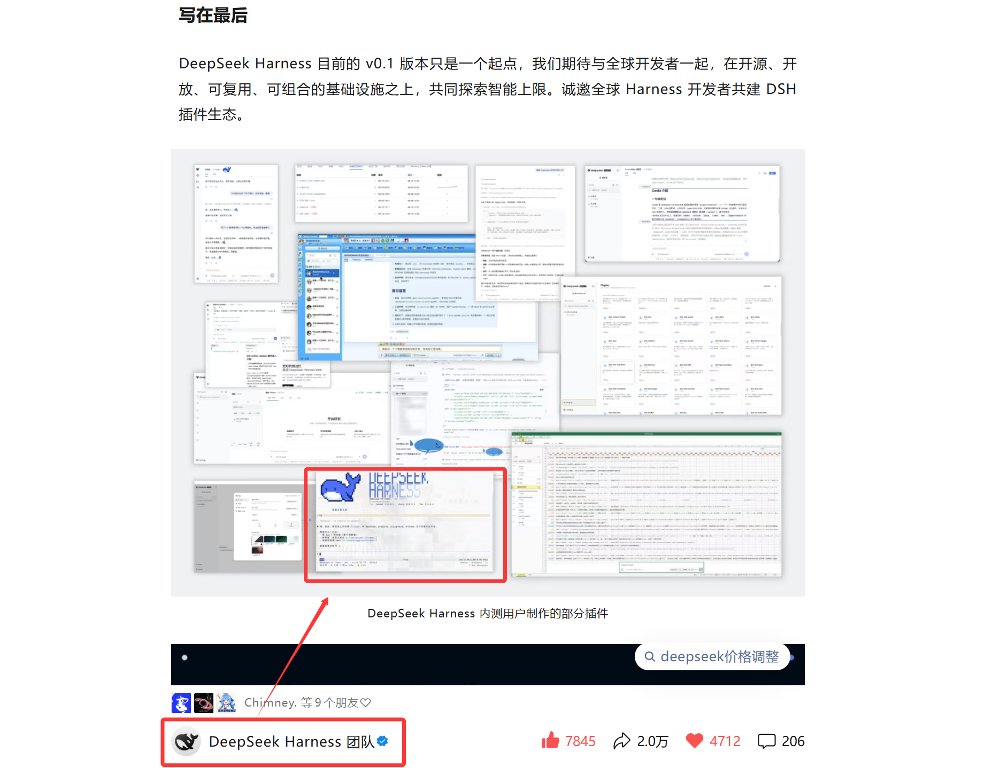

<p align="center">
  <a href="README_ZH.md">简体中文</a> | <strong>English</strong>
</p>

<p align="center">
  
</p>

# dsh-TUI

> DeepSeek Harness currently has no official terminal TUI (only a Web UI), so I built dsh-cc-tui!

  

## 🎉 Featured by DeepSeek Harness

This plugin was featured by the **official DeepSeek Harness WeChat account** as a selected early-access community plugin:

<p align="center">
  
</p>

## Interface Preview


## Why Install It: Beautiful and Easy to Use

- **Live activity line**: the model's live activity remains visible above the input while it works,
  with dozens of status variations.
- **Model state at a glance**: the bottom status bar shows the current model state and
  `git branch · working directory · session title` on the right.
- **Streaming thoughts remain visible**: thinking blocks expand while they are generated,
  collapse at the end of a turn, and can be expanded at any time with Ctrl+O.
- **Double-Esc time rewind**: roll the conversation back to any historical message.
- **And more features waiting to be discovered...**

## How to Install

```sh
  # 1. Install DeepSeek Harness (skip if already installed)
  npm install -g @deepseek-ai/dsh

  # 2. Install this plugin
  dsh plugin --profile ds-tui add dsh-cc-tui

  # 3. Start it
  #    On Windows, you can also use dsh-cc.cmd from this repository
  #    (equivalent, with --resume to restore the previous session)
  dsh --profile ds-tui
```

## And More......

For configuration, usage details, technical notes, and known limitations, see
[the documentation index](docs/Index_EN.md).
