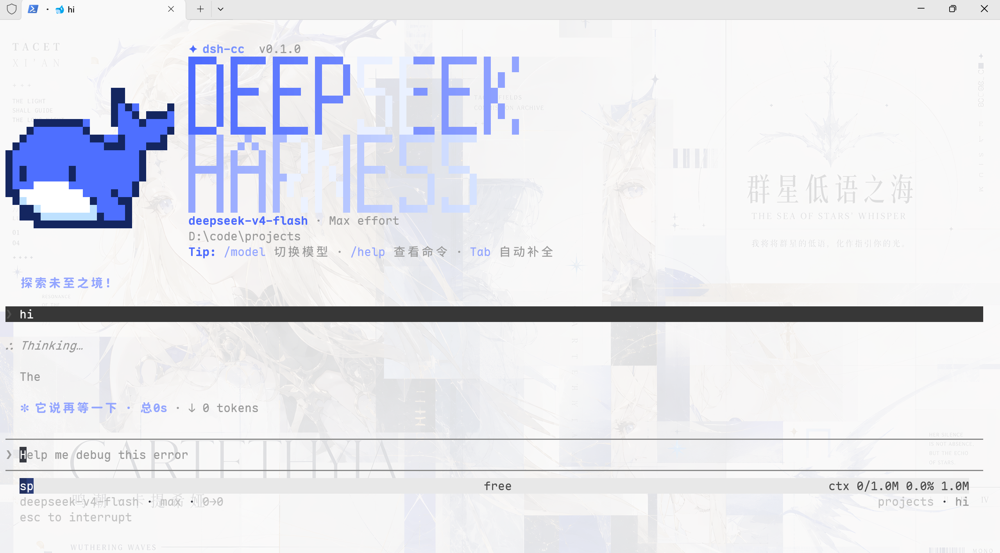

<p align="center">
  
</p>

<p align="center">
  <strong>简体中文</strong> · <a href="README_EN.md">English</a>
</p>

<p align="center">
  <a href="https://www.npmjs.com/package/dsh-cc-tui"></a>
  <a href="https://github.com/ccch1mneyyy/dsh-TUI/actions/workflows/ci.yml"></a>
  <a href="LICENSE"></a>
  
</p>

# dsh-TUI

`dsh-TUI` 是 DeepSeek Harness 的交互式终端前门：通过 Cordis 插件挂载，
提供接近 Claude Code 的对话、工具调用、会话管理和全屏终端体验，同时继续使用
DSH 官方的 Agent、模型、工具、会话与持久化服务。

项目不修改 DeepSeek Harness 核心代码。安装插件即可启用，卸载后不会留下核心补丁。

> 当前状态：公开测试版。适合日常使用与二次开发；涉及权限、终端兼容性和已知限制的
> 部分请先阅读[架构与限制](docs/architecture.md)。

## 核心能力

- **终端原生交互**：流式 Markdown、结构化工具卡、命令与文件补全、历史搜索、
  消息选择、inline/alternate-screen 两种渲染模式。
- **可观察的 Agent 状态**：实时工作状态、上下文分段进度、TPS、缓存命中率、
  推理等级、输入/输出 token 与 Git/会话信息。
- **完整会话工作流**：`/resume`、`/new`、`/compact`、`/export`、模型切换，
  以及双击 `Esc` 发起的会话 rewind/fork。
- **DSH 官方能力接入**：Agent preset、Skills、MCP、Goals、Todos、子代理、
  `ask_user_question` 问卷都通过现有服务或注册表连接。
- **为长会话设计**：事件驱动投影、差分终端输出、消息虚拟化、回放合并与有界缓存，
  避免渲染成本和内存随会话无限增长。

## 界面预览

<p align="center">
  
</p>

实时工作状态、Goal/Todo 与上下文指标：

<p align="center">
  
</p>

## 快速开始

前置条件：可用的终端 TTY、官方 `dsh` CLI，以及 `pnpm`。运行模型还需要
`DEEPSEEK_API_KEY`。

```sh
# 1. 安装 DeepSeek Harness CLI
npm install -g @deepseek-ai/dsh

# 2. 安装 dsh-TUI profile 插件
dsh plugin --profile cc-tui add dsh-cc-tui

# 3. 启动
dsh --profile cc-tui
```

仓库中的 `sh install.sh` 封装了第 2 步并检查前置命令。Windows 用户也可以使用
`dsh-cc.cmd`；传入 `--resume` 会恢复最近选择的会话。

安装流程、profile 叠加机制、源码构建与常见问题见
[安装与快速开始](docs/getting-started.md)。

## 文档

| 主题 | 内容 |
| --- | --- |
| [安装与快速开始](docs/getting-started.md) | 前置条件、安装、启动、profile 生命周期、源码开发 |
| [配置参考](docs/configuration.md) | Cordis 覆盖、配置字段、Agent preset、MCP、环境变量 |
| [主题系统](docs/themes.md) | 内置主题、自动检测、自定义 JSON 主题与校验规则 |
| [交互与命令](docs/interaction.md) | 快捷键、鼠标、问卷、slash command 与会话工作流 |
| [架构与限制](docs/architecture.md) | 运行链路、渲染与持久化设计、安全边界、已知限制 |
| [开发约定](AGENTS.md) | 仓库结构、构建产物、验证矩阵与代码修改规则 |

完整的中英文索引见 [`docs/README.md`](docs/README.md)。

## 工作方式

```text
dsh profile
  -> dsh-base
  -> dsh-TUI Cordis patch
  -> Agent preset + DSH services
  -> session/event
  -> Channel projection
  -> React components
  -> ported Ink/Yoga renderer
  -> terminal
```

TUI 只负责交互与呈现。会话日志是对话真源，模型调用、工具执行、fork/resume、
compaction 和持久化继续由 DSH 服务拥有。更详细的模块边界与性能设计见
[架构文档](docs/architecture.md)。

## 开发

CI 使用 Node 24 与 pnpm 11；包声明支持 Node `^22.19 || >=24`。

```sh
pnpm install --frozen-lockfile
pnpm build
pnpm smoke
```

`pnpm build` 会把 `src/` 编译到已提交的 `lib/types/`。修改源码时必须同步生成产物；
渲染、问卷和工具卡还需运行对应回归脚本。完整要求见 [`AGENTS.md`](AGENTS.md)。

## 权限与安全边界

`dsh-TUI` 不实现独立沙箱，而是使用当前 DSH profile 的文件、Shell、sandbox 与
approval 策略。仓库提供的 profile 在非 Windows 平台默认采用工作区约束与审批；
Windows 当前没有对应的沙箱后端，组合会退回到 `danger-full-access` 且不弹审批。
在包含敏感凭证或不可信仓库的环境中启动前，请先检查 profile 配置。

详见[权限边界与已知限制](docs/architecture.md#权限与安全边界)。

## 官方收录

本插件曾被 DeepSeek Harness 官方公众号作为内测用户插件展示。
[查看收录截图](screenshots/wechat-official.png)。

## License

[MIT](LICENSE)
