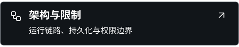
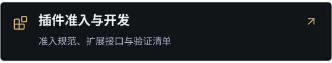
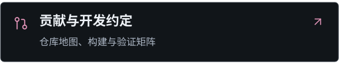
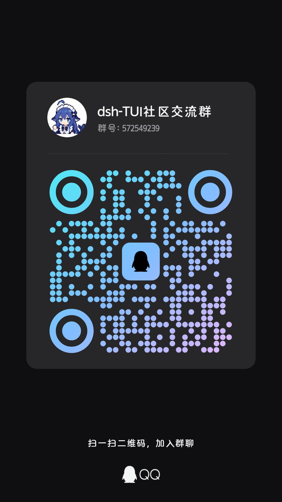

<p align="center">
  
</p>
<p align="center">
  <strong>简体中文</strong> · <a href="README_EN.md">English</a>
</p>

<p align="center">
  <a href="https://www.npmjs.com/package/@deepseek-harness-tui/dsh-tui"></a>
  <a href="https://github.com/ccch1mneyyy/dsh-TUI/actions/workflows/ci.yml"></a>
  <a href="LICENSE"></a>
  
</p>

# dsh-TUI

**DeepSeek Harness 的交互式终端工作台。** 在同一终端里对话、调用工具、管理会话。

纯插件挂载，不修改 Harness 核心；卸载后不留核心补丁。

## 界面预览

<picture>
  <source media="(max-width: 640px)" srcset="docs/assets/readme/preview-zh-mobile.svg">
  
</picture>

## 文档索引

<!-- readme-svg-navigation:start -->
<p align="center">
  <a href="docs/getting-started.md"></a>
  <a href="docs/configuration.md"></a>
  <a href="docs/interaction.md"></a>
  <a href="docs/themes.md"></a>
  <a href="docs/architecture.md"></a>
  <a href="docs/vscode.md"></a>
  <a href="https://github.com/T-Auto/dsh-ecosystem-spec/blob/main/docs/plugin-admission-and-development.md"></a>
  <a href="docs/contributing.md"></a>
</p>
<!-- readme-svg-navigation:end -->

## 核心能力

<table>
  <thead><tr><th width="112" align="left">能力</th><th align="left">亮点</th></tr></thead>
  <tbody>
    <tr><td><strong>对话工具</strong></td><td>流式回复、可折叠工具卡、文件引用与实时状态。</td></tr>
    <tr><td><strong>会话管理</strong></td><td>恢复、分支、后台任务、压缩与导出；随时切换模型。</td></tr>
    <tr><td><strong>编辑导航</strong></td><td>Vim 输入、全屏草稿、鼠标选区与历史回溯。</td></tr>
    <tr><td><strong>视觉体验</strong></td><td>图片预览与缩放、多主题、欢迎动画。</td></tr>
    <tr><td><strong>生态扩展</strong></td><td>接入 DSH 技能、MCP、子代理及 VS Code。</td></tr>
  </tbody>
</table>

[交互与命令](docs/interaction.md) · [架构与限制](docs/architecture.md)

## 快速开始

准备 [Node.js](https://nodejs.org/zh-cn)、pnpm 10+ 和交互式终端；模型请求需要 `DEEPSEEK_API_KEY`。

```sh
npm install -g @deepseek-ai/dsh @deepseek-harness-tui/dsh-tui
dsh-tui
```

也可用短命令 `dst` 启动。首次运行自动初始化 profile；API key 配置见[安装指南](docs/getting-started.md)。

<details>
<summary>手动安装与常见安装问题</summary>

如果你想手动安装，可以使用仓库根目录的 `install.sh`：

```sh
sh install.sh
# 或：dsh plugin --profile dsh-tui add @deepseek-harness-tui/dsh-tui
# 之后 dsh-tui 与 dsh --profile dsh-tui 等价
```

> **新用户提示**：若 `dsh plugin` 安装时报 `ERR_PNPM_IGNORED_BUILDS`（pnpm ≥11 默认阻止带安装脚本的依赖，如 `@google/genai`、`protobufjs`——这些脚本运行时不需要，忽略即可），在 profile 的 `pnpm-workspace.yaml` 里加入：
>
> ```yaml
> allowBuilds:
>   '@google/genai': false
>   protobufjs: false
> ```
>
> `/update` 与 `dsh-tui update` 会自动写入这份配置，无需手工处理。

更面向零基础的安装流程、profile 叠加机制、源码构建与常见问题见[安装与快速开始](docs/getting-started.md)。

</details>

### 更新与启动前诊断

启动后检查更新，但不自动安装。会话内执行 `/update` 可更新并恢复当前会话。

| 命令 | 用途 |
| --- | --- |
| `dsh-tui update` | 更新 profile，不启动 TUI |
| `dsh-tui doctor` | 检查环境、安装与凭证配置，不显示密钥 |
| `dsh-tui version` | 查看启动器与 profile 版本 |
| `dsh-tui help` | 查看命令帮助 |

`dst` 支持相同子命令。版本不一致时，按提示修复；详见[更新说明](docs/getting-started.md#更新到最新版本)。

## 插件扩展与开发指南

通过生态接口扩展终端体验，插件独立维护。

[开发规范](https://github.com/T-Auto/dsh-ecosystem-spec/blob/main/docs/plugin-admission-and-development.md) · [插件模板](https://github.com/dsh-tui-ecosystem/plugin-template) · [生态组织](https://github.com/dsh-tui-ecosystem)

<details>
<summary>接口稳定性与迁移参考</summary>

按当前实现成熟度给出的**非正式**分级，帮助插件作者评估投入；正式状态与兼容性协定以
[准入与开发指南](https://github.com/T-Auto/dsh-ecosystem-spec/blob/main/docs/plugin-admission-and-development.md)为准：

| 分级 | 接缝 |
| --- | --- |
| 稳定候选（形态冻结；如有破坏性变更，先在次版本弃用告警再移除） | 六 设置区块 · 八 全屏场景 · 十 托管对话框 · 十一 状态行 · 十二 键盘快捷键 · 十三 条目渲染器 |
| 实验性（仍可能随 dsh-std / 准入规范演进调整） | 九 决策事件 · toast 通知（`ctx.tuiToast`，新增） |
| 跟随上游（稳定性由 cordis / dsh 官方机制决定） | 一 会话事件 · 二 官方 prompt 槽位 · 三 技能打包 · 四 主题 · 五 system prompt 段 · 七 profile 组合 |

另：`@deepseek-harness-tui/dsh-tui/api`（纯类型入口）为实验性公开面；
`@deepseek-harness-tui/dsh-tui/test-utils` 子路径与 `ctx.tuiPluginHost.grants.corrupt`
已随 adapter 分层重构（#705）移除，`grants` 收窄为 `HostGrantFacade`，迁移细节见该 PR。

</details>

## 社区

使用交流、插件创意与功能建议，欢迎加入社区。

**微信：DSH-Plugins 社区交流 3 群** · **QQ：572549239**

<p align="center">
  <a href="screenshots/wechat-group.jpg"></a>
  <a href="screenshots/qq-group.jpg"></a>
</p>

微信群二维码会定期过期；失效时可加入 QQ 群或提交 issue。

[行为准则](CODE_OF_CONDUCT.md) · [相关项目](docs/links.md) · [贡献指南](docs/contributing.md)

<details>
<summary>官方收录与项目展示</summary>

本插件被 **DeepSeek Harness 官方公众号** 推文收录。

<p align="center">
  <a href="screenshots/wechat-official.png"></a>
</p>

[dshfind 插件目录](https://dshfind.com/ccch1mneyyy/dsh-TUI) · [Trending 记录](https://trendshift.io/repositories/146168)

</details>

## 权限与安全边界

> [!WARNING]
> **Windows 默认高权限：** `danger-full-access`，审批 `never`。文件与 Shell 操作不逐次确认；处理敏感或不可信内容前，请收紧 profile。

<table>
  <thead><tr><th width="112" align="left">边界</th><th align="left">规则</th></tr></thead>
  <tbody>
    <tr><td><strong>执行策略</strong></td><td>沿用 DSH profile 的沙箱与审批策略；TUI 不另设沙箱。</td></tr>
    <tr><td><strong>权限切换</strong></td><td><code>/permission</code> 或 <code>Shift+Tab</code> 选择 DSH 提供的预设。</td></tr>
    <tr><td><strong>状态校验</strong></td><td>以真实事件或读回确认；服务异常或无写路径时明确报错。</td></tr>
    <tr><td><strong>计划退出</strong></td><td>恢复进入前的权限；原预设仍可用时恢复其身份。</td></tr>
  </tbody>
</table>

[查看完整权限规则与已知限制](docs/architecture.md#权限与安全边界)

## 致谢

- 像素鲸鱼娘的 22 帧手绘原图（Excel 逐格绘制）与闲置动画行为（摆鱼鳍、拍尾巴、入睡冒 Z、点击冒爱心）移植自 **[dsh-ui-whale](https://github.com/lhh010/dsh-ui-whale)**（DeepSeek Harness Web 端鲸鱼宠物插件，作者 [@lhh010](https://github.com/lhh010)，BSD-3-Clause），感谢作者与灵感 🐋💜

<details>
<summary>Star History</summary>

<!-- star-history:start -->
[](https://star-history.com/#ccch1mneyyy/dsh-TUI&Date)
<!-- star-history:end -->

</details>

## License

[MIT](LICENSE)
