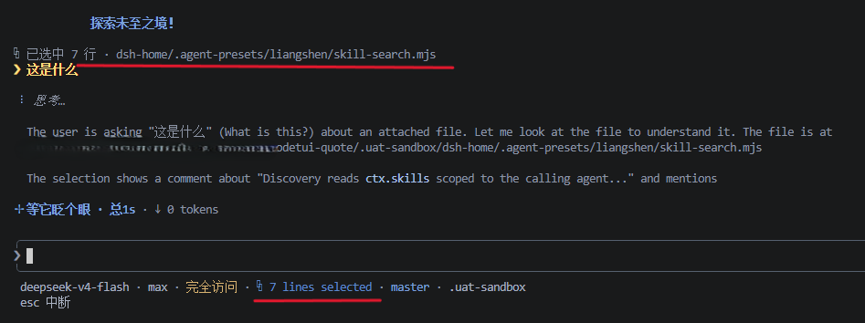

# Using dsh-TUI in VS Code

[Documentation index](README.md) · [中文](vscode.md)

dsh-TUI is a terminal program: it writes ANSI into a PTY and reads keys
back from the PTY. So any compatible terminal can host it — including the
**VS Code integrated terminal** (xterm.js). This page covers two ways to
use it:

**The `dsh-tui-vscode` companion extension (recommended)**

- sessions run in a real VS Code integrated terminal (a new column beside
  the editor);
- multiple concurrent sessions, a sidebar session history, one-click start;
- resume-last and specific-session resume;
- published on the VS Code Marketplace.

**Run directly in the built-in terminal**

- zero install, seconds to start;
- for when you do not want the extension.

> Version note: `dsh-tui` here means this repository (the TUI plugin);
> `dsh-tui-vscode` means the companion extension; the two are versioned
> and released independently. Full docs:
> [baobaolaodie/dsh-tui-vscode](https://github.com/baobaolaodie/dsh-tui-vscode)
>
> **The selection channel requires an extension that speaks protocol v2**
> (**dsh-tui-vscode >= 0.7.0**); with an older extension the feature stays
> silently disabled and everything else is unaffected.

## Option 1: the dsh-tui-vscode companion extension (recommended)

[`baobaolaodie/dsh-tui-vscode`](https://github.com/baobaolaodie/dsh-tui-vscode)
runs dsh-tui inside a real VS Code integrated terminal (`createTerminal`
plus the CLI running inside it), with no webview and no xterm emulation.
It does not touch the TUI's rendering core — it only **hosts** it and adds
editor integration.

### Extension features

- Editor-title button, activity-bar whale icon, and command-palette entries;
- a `DeepSeek` integrated terminal in a column beside the editor;
- one independent terminal and process per session, with existing sessions
  continuing in their own terminals;
- a sidebar session history grouped by project, with refresh and
  specific-session resume;
- environment injection for `DSH_TUI_LANG`, `$VISUAL`, `$DSH_HOME`, and a
  target session id;
- per-session termination when its terminal closes, or when `Ctrl+C` is
  pressed twice inside the TUI.

| Capability | Official Claude Code extension | dsh-tui-vscode |
| --- | --- | --- |
| Entry points | Activity-bar icon + editor-title button + command palette | Same (DeepSeek whale icon) |
| Session position | NEW column beside the active one (`ViewColumn.Beside`) | Same — never takes the current column |
| Terminal tab | `Claude Code` + logo icon | `DeepSeek` + whale icon |
| Session host | Real integrated terminal (default shell — PowerShell on Windows) | Same |
| Multiple sessions | Every click opens a new session terminal | Same; old sessions keep running |
| Sidebar | Sessions list | Session history (grouped by project — stronger) |
| Auto start/stop | Open = start; closing the terminal = end | Same |
| Env injection | — | `DSH_TUI_LANG` / `$VISUAL` / `$DSH_HOME` / session id / `DSH_TUI_IDE_PORT/TOKEN` (selection channel) |
| Editor selection sync | Selection enters context automatically; `⧉ N lines selected` under the prompt | Same (IDE selection channel, below) |

### IDE selection channel

With a dsh-tui build that includes the IDE selection channel, the extension
runs a loopback WebSocket server and writes a lock file (directory 0700,
file 0600).

- Extension-launched sessions connect via injected env vars at startup;
- manually launched sessions discover it by scanning the lock — only windows
  whose workspace covers the session directory are ever dialed. With no
  match the integration stays silently disabled and a foreign project is
  never connected.

Afterwards:

- Selecting code in the editor instantly shows a `⧉ N lines selected` badge
  under the TUI prompt (it disappears when the selection clears);
- Submitting a message attaches only the selected lines to the model
  context, with a `⧉ Selected N lines from <relative path>` indicator above
  the user bubble (resuming after a restart still rebuilds that indicator);
- Selection pushes carry the editor buffer's OWN text — unsaved edits are
  attached exactly as you see them on screen; oversized selections are
  capped and marked with the same policy as @-mentions;
- Without an IDE or on disconnect everything degrades silently with zero
  impact on the rest of the TUI.



**Protocol & versions**:

- After connecting, the TUI sends `ide/hello` (token + protocolVersion);
- the extension answers `ide/hello_ack` (protocolVersion + workspaceFolders)
  only when the token validates — the link counts as established only after
  a valid v2 ack; a wrong token is silently dropped;
- `selection_changed` then carries absolute 0-based inclusive line numbers
  plus the editor buffer's own selection text;
- lock discovery only ever dials windows whose workspace covers the session
  directory and stays silently disabled without a match;
- both ends of the protocol must ship at the same version.

### Prerequisites

- VS Code >= 1.90;
- Global `dsh` CLI and `dsh-tui` (**dsh-tui 0.7.0+ recommended**, see
  [Getting started](getting-started.en.md)):

  ```sh
  npm install -g @deepseek-ai/dsh @deepseek-harness-tui/dsh-tui
  ```

- `DEEPSEEK_API_KEY` for running models (in the terminal environment or the
  dsh configuration).

### Install

**From the VS Code extension panel (recommended)**: press `Ctrl+Shift+X`,
search for **`dsh-tui`** and install with one click (publisher
`baobaolaodie`), or open the
[Marketplace page](https://marketplace.visualstudio.com/items?itemName=baobaolaodie.dsh-tui-vscode)
directly.

Or build from source:

```sh
git clone https://github.com/baobaolaodie/dsh-tui-vscode.git
cd dsh-tui-vscode
npm install
npm run package && code --install-extension dsh-tui-vscode-<version>.vsix --force
# or: npm run install:local
```

### Quick start

1. Click the **editor-title whale button** (or the command-palette entry
   `dsh-tui: Start new session / 启动新会话`) — a **DeepSeek** terminal
   opens on the Beside column and runs dsh-tui automatically.
2. The **activity-bar whale icon** opens the sidebar session history; its
   welcome view offers start/resume buttons.
3. Click again = **another concurrent session**; older sessions keep
   running in their own terminals.
4. **Resume the last session**: `dsh-tui: Resume last session / 恢复上次会话`.
5. **Resume a specific session**: expand a project group in the sidebar
   "会话历史" and click the session entry.
6. **Terminate**: close the terminal tab (ends only that session), or
   double `Ctrl+C` inside the TUI; the command
   `dsh-tui: Terminate session / 终止会话` sends Ctrl+C to the most recent
   terminal.

While sessions are running, a **status-bar** item (`dsh-tui`, bottom-left)
appears; clicking it starts a new session (`dsh-tui-vscode.open`).

### Command reference

| Command ID | Title | Action |
| --- | --- | --- |
| `dsh-tui-vscode.open` | Open panel / 打开会话面板 | Start a new session (the editor-title button uses this entry point too) |
| `dsh-tui-vscode.start` | Start new session / 启动新会话 | Start a new session |
| `dsh-tui-vscode.resume` | Resume last session / 恢复上次会话 | Resume via `--resume` |
| `dsh-tui-vscode.focus` | Focus session panel / 聚焦会话面板 | Focus the most recent terminal, else start one |
| `dsh-tui-vscode.kill` | Terminate session / 终止会话 | Send Ctrl+C to the most recent terminal |
| `dsh-tui-vscode.refreshSessions` | Refresh sessions / 刷新会话列表 | Manually refresh the sidebar |
| `dsh-tui-vscode.resumeSession` | Resume session / 恢复会话 | Resume a specific session (sidebar click) |
| `dsh-tui-vscode.insertAtMention` | Insert @-mention / 插入 @文件引用 | With editor focus press `Ctrl+Alt+K` (macOS `Cmd+Alt+K`) or the editor context menu: inserts the current file / selection as `@absolute/path Lstart-end` into the dsh-tui input box (the absolute path is independent of the dsh-tui session cwd; whole file when nothing is selected; falls back to the clipboard with no running session) |

### Architecture

- The extension runs a loopback WebSocket server and writes a lock file
  (directory 0700, file 0600).
- Extension-launched sessions connect via injected env vars at startup.
- Manually launched sessions (e.g. tmux / SSH) discover it by scanning the
  lock — only windows whose workspace covers the session directory are ever
  dialed; with no match it stays silently disabled and a foreign project is
  never connected.
- The connection speaks protocol v2: the TUI sends `ide/hello`, the
  extension answers `ide/hello_ack`, then `selection_changed` pushes
  selections.
- Without an IDE or on disconnect, everything degrades silently with zero
  impact on the rest of the TUI.

### Configuration

| Key | Default | Description |
| --- | --- | --- |
| `dsh-tui-vscode.command` | `dsh-tui` | Launch command (resolved to an absolute path against the host PATH) |
| `dsh-tui-vscode.extraArgs` | `[]` | Extra CLI args, e.g. `["--lang","en"]` |
| `dsh-tui-vscode.lang` | `""` | `""`/`zh`/`en`, exported as `DSH_TUI_LANG` |
| `dsh-tui-vscode.injectEditor` | `true` | Export `$VISUAL` when unset |
| `dsh-tui-vscode.editorCommand` | `code -w` | Value exported as `$VISUAL` |
| `dsh-tui-vscode.dshHome` | `""` | `$DSH_HOME` override (empty = inherit) |

### Development and verification

Entry-level commands in the extension repository:

```sh
npm install
npm run typecheck   # tsc --noEmit
npm test            # compile + node --test (data-layer unit tests)
npm run test:e2e    # real extension-host tests (xvfb-run -a on Linux)
npm run package     # compile + build the .vsix
```

`npm run install:local` installs locally in one step; the CI job matrix and
commit hooks live in the extension repository's own docs.

### Known limitations

- Session content is terminal content: scrollback is managed by the VS Code
  integrated terminal;
- Specific-session resume requires this profile's `cordis.patch.yml`
  (dsh-tui 0.7.0+);
- For logs without a `session` header, the project name comes from decoding
  the cwd-encoded group dir, which is lossy for hyphenated project names
  (e.g. `flow-comet` → `flow\comet`); the real cwd is still available in
  the item tooltip.

## Option 2: run directly in the VS Code integrated terminal

When you do not want the extension, run dsh-tui directly in the integrated
terminal. Prerequisites match [Getting started](getting-started.en.md):
global `dsh` CLI and `dsh-tui` (the first run bootstraps the profile; pnpm
is required).

1. Open the VS Code integrated terminal (`` Ctrl+` ``) and run:

   ```sh
   dsh-tui
   ```

2. Resume the last session:

   ```sh
   dsh-tui --resume
   ```

   > `-c` / `--continue` is equivalent to `--resume`; `dsh-tui --resume <id>`
   > (or `--resume=<id>`, since 0.7.0) resumes a specific session.

dsh-TUI has dedicated compatibility paths for xterm.js (VS Code / Cursor /
code-server):

- truecolor;
- OSC 8 links (rendered clickable by VS Code itself);
- OSC 52 clipboard (VS Code prompts for permission on first use);
- synchronized output and smooth draining.

These are handled in `src/ink/` under the `TERM_PROGRAM=vscode` detection
branches. Streaming Markdown, tool cards, scrolling, and double-Esc time
travel behave the same as in a standalone terminal.

### Make `Ctrl+G` edit the current input in VS Code

The TUI's `Ctrl+G` uses `$VISUAL`/`$EDITOR`. To edit in VS Code, export
`code -w` in the terminal environment (`settings.json`, key
`terminal.integrated.env.<platform>`):

```jsonc
{
  "terminal.integrated.env.windows": { "VISUAL": "code -w" },
  "terminal.integrated.env.linux":   { "VISUAL": "code -w" },
  "terminal.integrated.env.osx":     { "VISUAL": "code -w" }
}
```

(The companion extension exports `code -w` automatically when neither
`$VISUAL` nor `$EDITOR` is set — see Option 1.)

### UI language

`DSH_TUI_LANG` defaults to Chinese; for the English UI, add
`"DSH_TUI_LANG": "en"` to the env block above.

### Known differences (built-in terminal)

| Capability | Behavior in the integrated terminal |
| --- | --- |
| Mouse wheel / drag selection | Handled by the integrated terminal; "copy on release" surfaces as OS-level copy behavior |
| Extended keyboard protocol | modifyOtherKeys / win32-input-mode behavior is decided by xterm.js and may differ from kitty / WezTerm |
| OSC 52 clipboard | First use triggers VS Code's own permission prompt |

For the full protocol behavior of a standalone terminal (e.g. complex mouse
semantics), use an external terminal window (Windows Terminal / kitty /
WezTerm / iTerm2 / tmux).

## Which option to choose

| Scenario | Choice |
| --- | --- |
| Need multiple sessions, session history, and specific-session resume | Option 1: companion extension |
| Occasional use, no extension wanted | Option 2: built-in terminal |
| Need a standalone terminal's full protocol behavior (complex mouse semantics, etc.) | External terminal window |

## Acceptance baseline

Per [Contributing](contributing.en.md), VS Code is a supported terminal
platform. Any rendering change should be walked through inside the VS Code
integrated terminal in both inline and fullscreen modes at narrow widths —
startup, resize, scroll, input, cancel, and clean exit.
