# 12 款欢迎页 UI · 修复版

以用户提供的 12model 为唯一选款依据：前三张像素参考图含 6 款，另有 6 款 PNG。

| 编号 | 模式 | 设置值 | 类型 |
|---|---|---|---|
| 01 | 原版 · 标准姿态 | `classic` | 原生像素 |
| 02 | 喷水 | `spout` | 原生像素 |
| 03 | 爱心 | `heart` | 原生像素 |
| 04 | 睡觉 | `sleep` | 原生像素 |
| 05 | 睡眠字形 DEEP SLEEP | `deepsleep` | 原生像素 |
| 06 | 彩虹鲸鱼 × DSH | `rainbow` | 原生像素 |
| 07 | 16 · 等深 | `isobath` | PNG |
| 08 | 06A+ · 加密点阵 | `dots` | PNG |
| 09 | R5U · 晶体切面 | `crystal` | PNG |
| 10 | R1U · 信号故障 | `glitch` | PNG |
| 11 | R3 · 强烈故障 | `heavy` | PNG |
| 12 | 07 · 浮雕像素 DSH | `relief` | PNG |

切换：`/settings → 欢迎页头图方案`，设置键 `dsh-tui.welcomeArt`，默认 `classic`。原项目已有设置面板，本次在其中加入头图选项。

前六款直接绘制方形像素，空白处沿用终端背景。后六款的 11 张透明 PNG 与原始设计资产 SHA256 一致；10 和 11 共用同一张鲸鱼，12 沿用原版鲸鱼。

以下是生产组件输出的渲染捕获：01–06 为字符网格，07–12 解码渲染器实际发送的 Kitty RGBA 和放置坐标，按 10×20 像素单元重放。它们不是物理终端的屏幕截图，也不是把高清素材手工贴在低清截图上。实际字体和单元比例可能因终端而异。

PNG 高清显示需全屏 Kitty/Sixel 终端，至少 92 列。普通终端、inline 模式显示标明“简化预览”的字符回退，不能保持点阵/细线的全部细节。06 是参考构图的原生像素重建，不复制原图的渐变底或写死的状态文字。02–05 是静态姿态款。

### 01 · 原版 · 标准姿态

| 黑色终端 | 白色终端 |
|---|---|
| 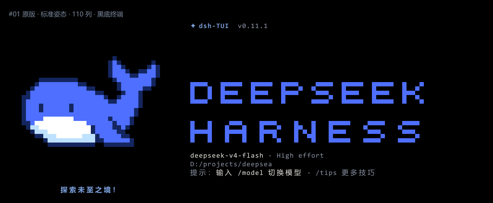 | 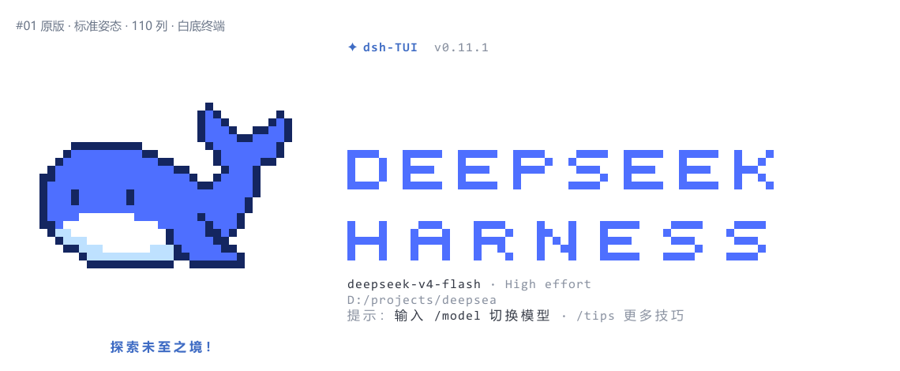 |

### 02 · 喷水

| 黑色终端 | 白色终端 |
|---|---|
| 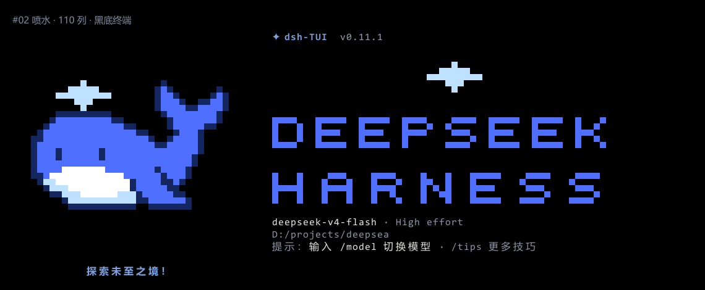 | 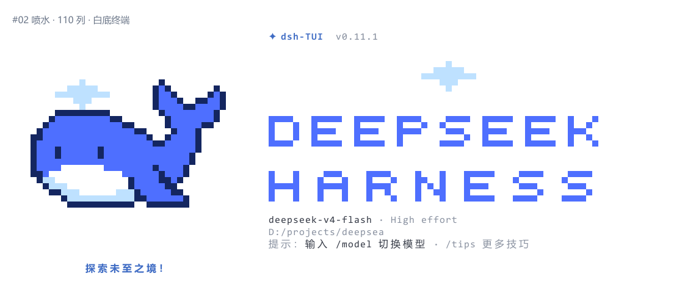 |

### 03 · 爱心

| 黑色终端 | 白色终端 |
|---|---|
| 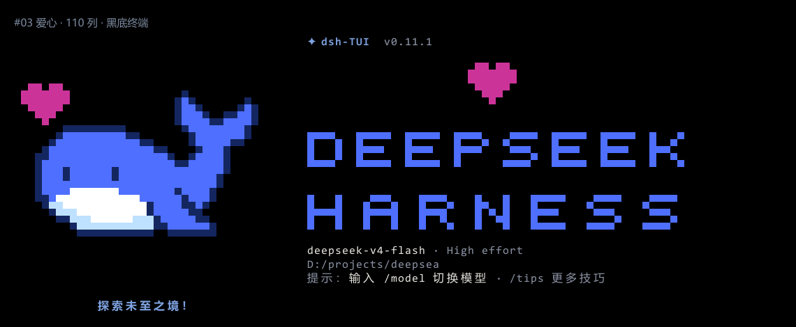 | 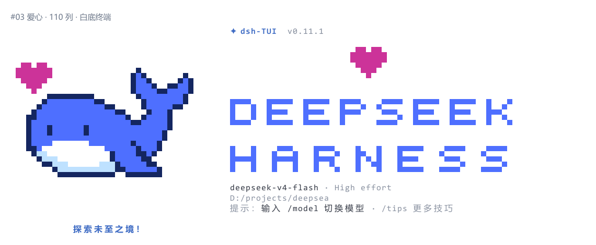 |

### 04 · 睡觉

| 黑色终端 | 白色终端 |
|---|---|
| 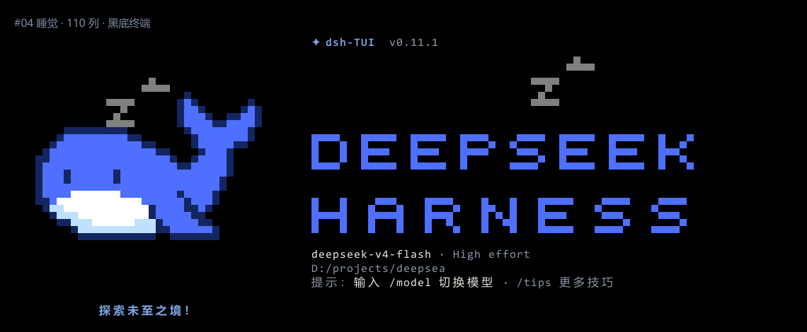 | 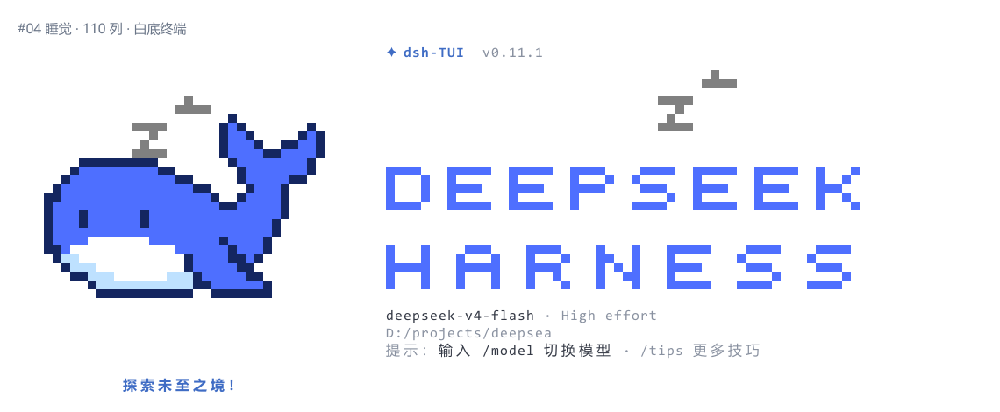 |

### 05 · 睡眠字形 DEEP SLEEP

| 黑色终端 | 白色终端 |
|---|---|
| 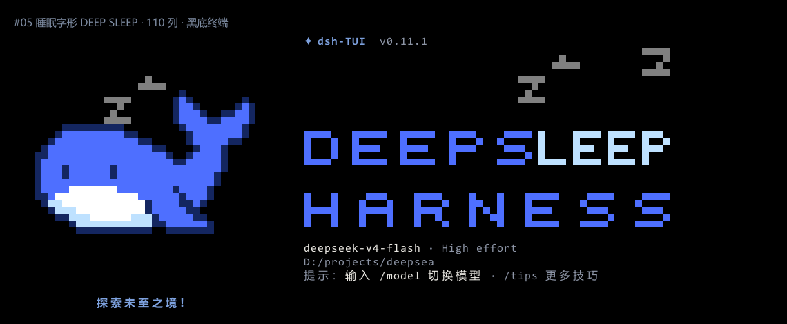 | 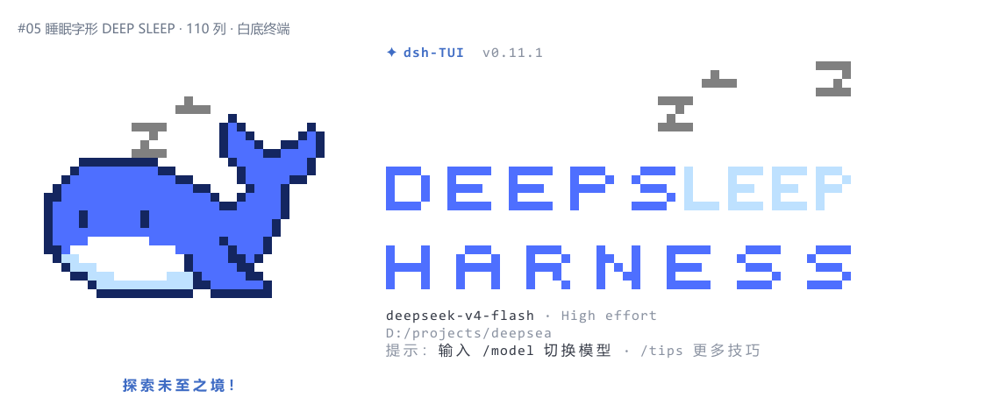 |

### 06 · 彩虹鲸鱼 × DSH

| 黑色终端 | 白色终端 |
|---|---|
| 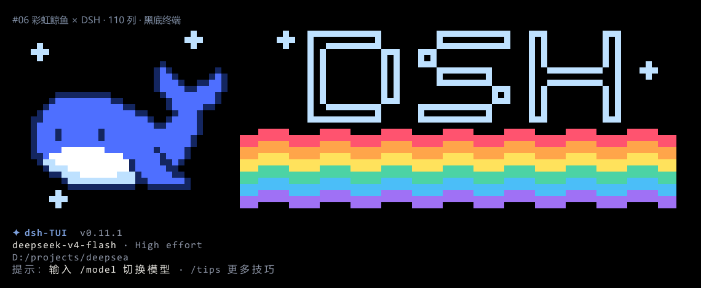 | 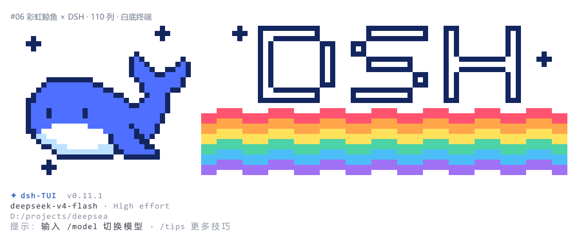 |

### 07 · 16 · 等深

| 黑色终端 | 白色终端 |
|---|---|
| 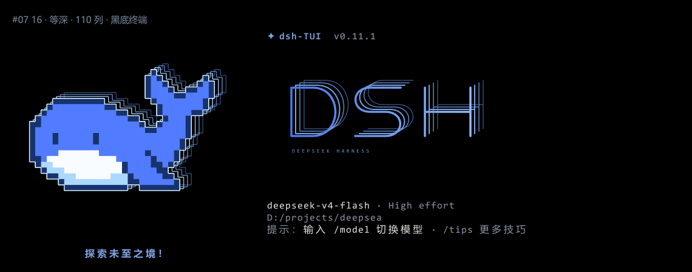 | 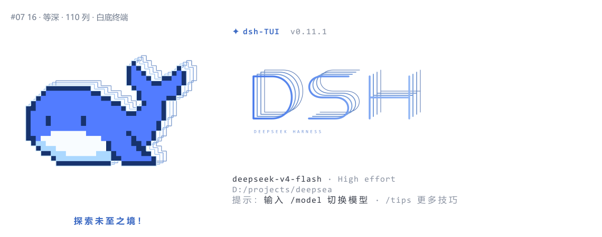 |

### 08 · 06A+ · 加密点阵

| 黑色终端 | 白色终端 |
|---|---|
| 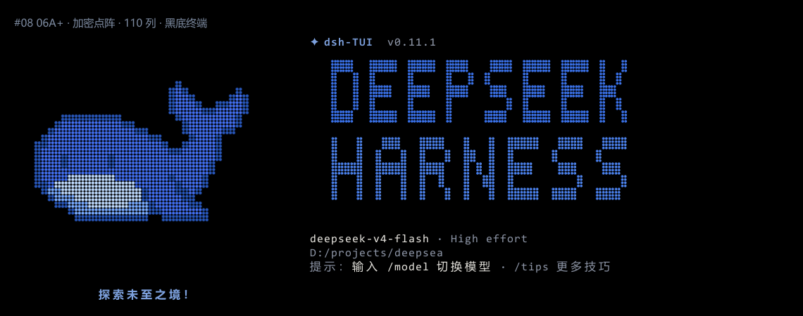 | 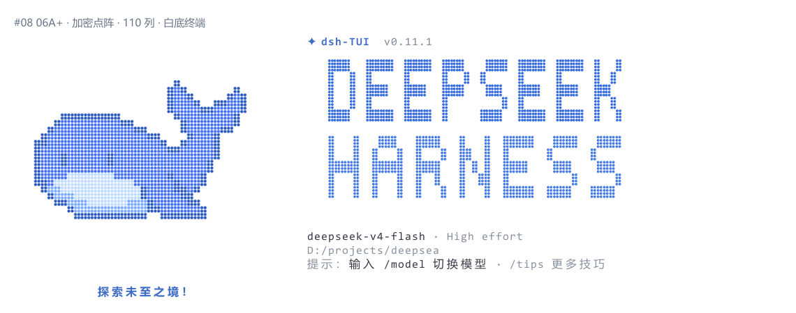 |

### 09 · R5U · 晶体切面

| 黑色终端 | 白色终端 |
|---|---|
| 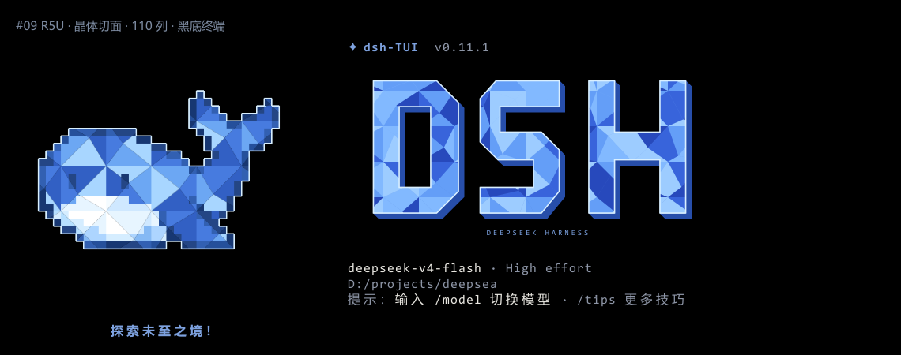 | 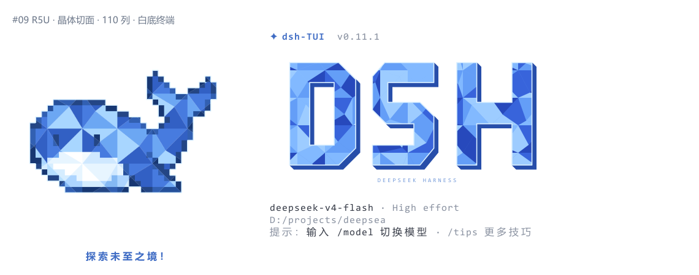 |

### 10 · R1U · 信号故障

| 黑色终端 | 白色终端 |
|---|---|
| 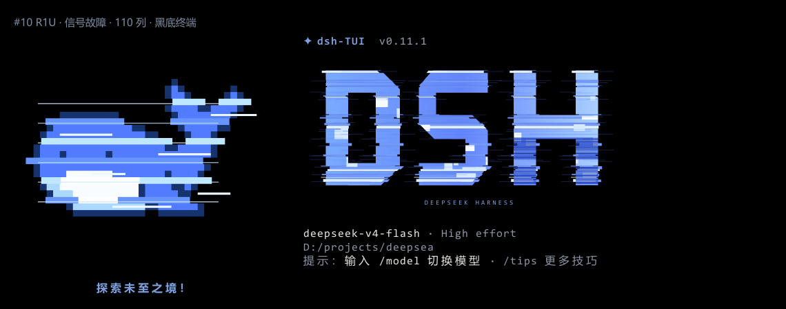 | 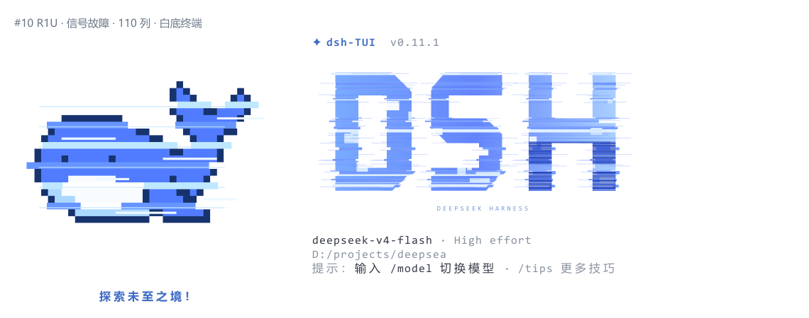 |

### 11 · R3 · 强烈故障

| 黑色终端 | 白色终端 |
|---|---|
| 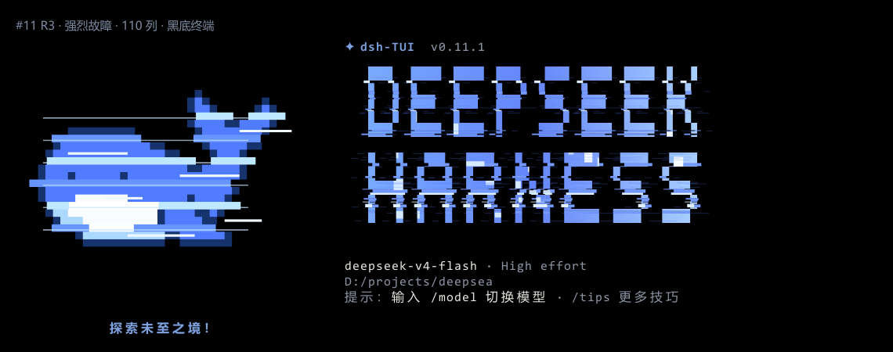 | 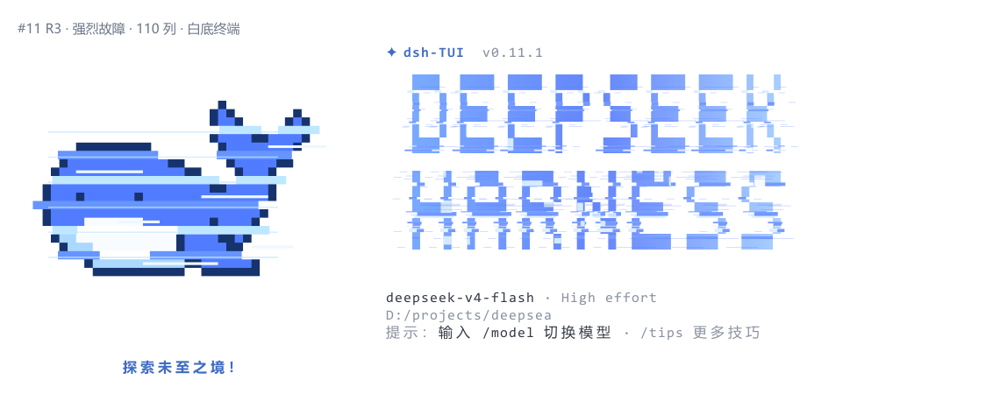 |

### 12 · 07 · 浮雕像素 DSH

| 黑色终端 | 白色终端 |
|---|---|
| 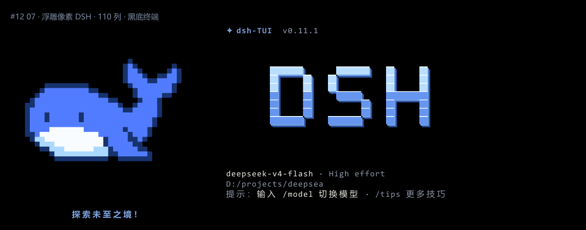 | 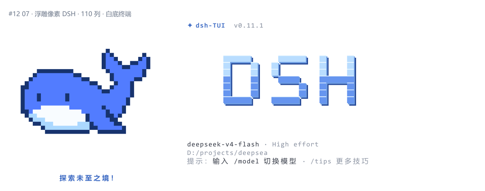 |
